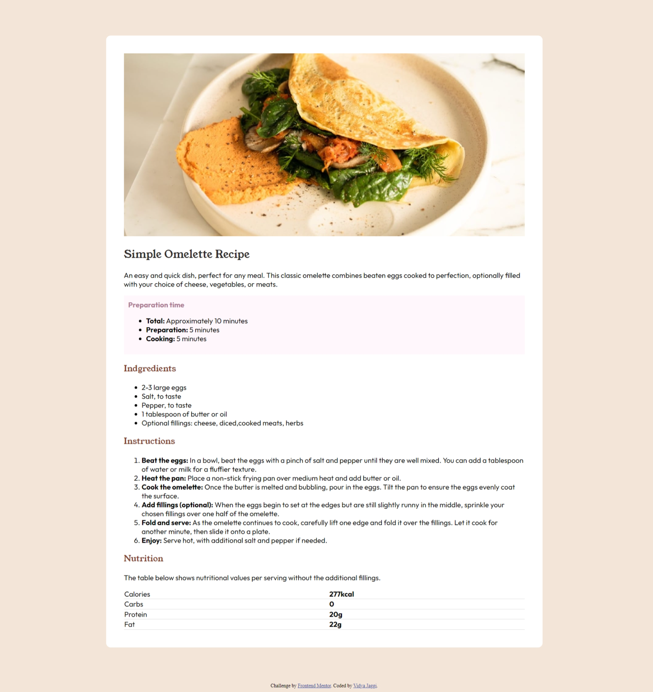

# Frontend Mentor - Recipe page solution

This is a solution to the [Recipe page challenge on Frontend Mentor](https://www.frontendmentor.io/challenges/recipe-page-KiTsR8QQKm). Frontend Mentor challenges help you improve your coding skills by building realistic projects. 

## Table of contents

- [Overview](#overview)
  - [The challenge](#the-challenge)
  - [Screenshot](#screenshot)
- [My process](#my-process)
  - [Built with](#built-with)
  - [What I learned](#what-i-learned)
- [Author](#author)

## Overview

### Screenshot

### Links

- Solution URL:[Solution] (https://github.com/vidyaa01/recipe-page-main)
- Live Site URL:[Live site](https://recipe-page-main-mbcx3o4xs-vidyaa01s-projects.vercel.app/)

## My process

### Built with

- Semantic HTML5 markup
- CSS custom properties
- Flex
- Mobile-first workflow

### What I learned

- using media queries
- how to  the code structure in a better way

## Author

- Linkedin - [Vidya Jaggi](www.linkedin.com/in/vidya-jaggi)
- Frontend Mentor - [@vidyaa01](https://www.frontendmentor.io/profile/@vidyaa01)

